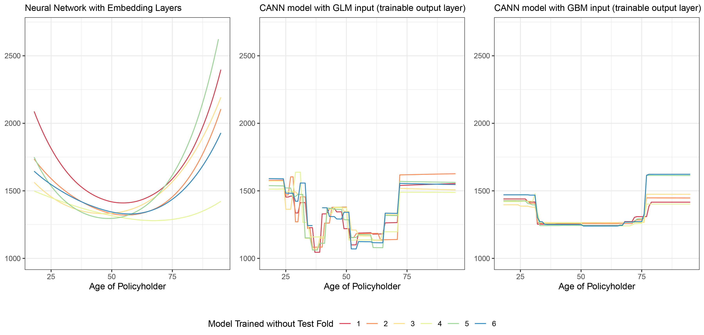

```{r setup, include=FALSE}
options(htmltools.dir.version = FALSE)
library(knitr)
knitr::opts_chunk$set(warning = FALSE, message = FALSE)
# options(knitr.table.format = "html")
library(tidyverse)
library(fontawesome) # from github: https://github.com/rstudio/fontawesome 
library(DiagrammeR)
#library(emo) # from github: https://github.com/hadley/emo
library(gt) # from github: https://github.com/rstudio/gt
#library(countdown) # from github: https://github.com/gadenbuie/countdown 
library(here)
```

```{r setup_greenwell, include=FALSE}
# Set global R options
options(htmltools.dir.version = FALSE, servr.daemon = TRUE, 
        crayon.enabled = TRUE)

# Set global knitr chunk options
knitr::opts_chunk$set(
  dev = "svg",
  fig.align = "center",
  cache = TRUE,
  error = FALSE,
  message = FALSE, 
  warning = FALSE, 
  collapse = TRUE 
)

# colors - I copied most of these from # https://github.com/edrubin/EC524W20
dark2 <- RColorBrewer::brewer.pal(8, name = "Dark2")
KULbg <- "#116E8A"
red_pink   = "#e64173"
turquoise  = "#20B2AA"
orange     = "#FFA500"
red        = "#fb6107"
blue       = "#3b3b9a"
green      = "#8bb174"
grey_light = "grey70"
grey_mid   = "grey50"
grey_dark  = "grey20"
purple     = "#6A5ACD"
slate      = "#314f4f"
```

class: bottom, left, title-slide, clear

background-image: url('img_f/beamer_title_KUL.png')
background-size: contain

name: titlepage

# Machine Learning Applications in Insurance


<html><div style='float:left'></div><hr color='#FAFAFA' size=1px width=100%></html>

<span style="color:#FAFAFA;font-size:18.0pt">
Freek Holvoet <br>
22 October 2021 <br>
</span>

<span style="color:#FAFAFA;font-size:14.0pt">
Course: AI Applications<br>
Lecturer: Dr. ir. Lynn Houthuys <br>
</span>
---

name: whoami
# Who am I?

.pull-left-big[
### About myself
Name: .KULbginline[Freek Holvoet]

Occupation: .KULbginline[Actuary]

- 2014-2015: Risk Modelling Trainnee @ Delta Lloyd Life
- 2015-2017: Risk Modelling Expert @ Delta Lloyd Life
- 2017-2021: Risk Modelling Expert @ NN Insurance Belgium
- 2021-...: Phd Researcher @ [LRisk KU Leuven](https://feb.kuleuven.be/drc/LRisk)

### What is an actuary?
In short: .hi-pink[an insurance mathematician]. An actuary does pricing, reserving, cash flow modelling, reporting,... 
]
.pull-right-small[

<br>


<br>


<br>


]

---

name: overview
# Overview

### What will we see today?
.pull-left[
<ul>
  <li> Different types of insurances </li>
  <li> Different applications for machine learning </li>
  <li> Case study into MTPL Insurance </li>
  <ul>
    <li> How to calculate premiums </li>
    <li> A look into the data </li>
    <li> Generalized Linear Model </li>
  </ul>
  <li> Machine learning techniques in our case study </li>
  <ul>
    <li> \(K\) times \(K-1\) -fold cross-validation scheme </li>
  </ul>
</ul>
]
.pull-right[
<ul>
  <ul>
    <li> Gradient Boosting Model </li>
    <li> Neural Networks </li>
    <li> Combined Actuarial Neural Networks) </li>
  </ul>
  <li> Model interpretation techniques </li>
  <ul>
    <li> Why we need interpretation </li>
    <li> Variable importance plots </li>
    <li> Partial dependency plots </li>
  </ul>
</ul>
]

---


class: middle, clear

### What types of insurances do you know?

---

# Different types of insurances

.pull-left[

### Life insurances

- Traditional life insurance (whole life, endowment)
- Term insurance
- Mortgage related term insurance
- Unit linked
- Universal life
- Employee benefit (second pillar pension saving)

]

.pull-right[

### Non-Life Insurances

- Car insurance (.hi-pink(MTPL) insurance)
- Health and disability insurance (hospitalization)
- Unemployment insurance
- Home insurance (Fire, Renter,...)
- Travel insurance
- Family and personal liability insurance (.hi-pink['BA'] or .hi-pink['familiale'] in dutch)

]

.center[

<br>

.KULbginline[And many many more]

]

---

# Different types of insurances

### How does insurance work?

You (customer) pays a premium, .hi-pink[if] at a .hi-pink[later time] a claim occurs, the insurer pays a .hi-pink[certain amount] to you.

This is called an .KULbginline[inverse production cycle]
You pay for the product first, and only later does the insurer knows how much the product actually costs

--

.pull-left[

##### Life insurance
You ( $21$ years old) take a loan at the bank of &euro; $200,000$ to be paid back over $20$ years, together with a mortgage insurance (dutch: .hi-KUL[schuldsaldo verzekering]). 

If you die before the loan is payed back, the insurer pays the remaining amount.

]

--

.pull-right[

##### Non-Life insurance <br>

You own a car worth &euro; $8,000$ , and you take a .hi-KUL[full omnium] insurance. 

If you cause a car accident, the insurer pays back the damage to your car, other cars and all personal injuries. 

]

---

# Different applications for machine learning

### Many applications for machine learning in insurance

- Fraud detection in claims
- Mortality rate modelling
- Lapse rate modelling
- Frequency - severity modelling
- Grouping of modelpoints
- Telematics

Lots of .hi-pink[data] and lots of .hi-pink[things to predict]: the perfect playground for data scientists!

---

# Case study into MTPL Insurance

```{r include=FALSE}

#setwd('C:/Users/Frynn/Dropbox/Freek research project/Code Freek/Code_FH')
setwd('C:/Users/freek/Dropbox/Freek research project/Code Freek/Code_FH')

packages <- c("sp", "vip","ggplot2",
              "pdp","cplm","mltools",
              "data.table", "keras", "tensorflow",
              "reticulate","tfestimators", "tidyverse",
              "gtools", "beepr", "gbm",
              "gridExtra", "cowplot", "RColorBrewer",
              "fuzzyjoin", "colorspace", "sf",
              "tmap", "rgdal","egg")
suppressMessages(packages <- lapply(packages, FUN = function(x) {
  if (!require(x, character.only = TRUE)) {
    install.packages(x)
    library(x, character.only = TRUE)
  }
}))

# Setup tensorflow for runs
tensorflow::use_condaenv( "tf_gpu")
conda_python(envname = "tf_gpu")
options(keras.view_metrics = FALSE)
options(pillar.sigfig = 5)

# Read in all data
data_readin<-readRDS("./Data/Data.rds") #Dataset
glm_data<-readRDS("./Data/data_glm.rds") #Data used in glm model
gbm_fits<-readRDS("./Data/mfits_gbm.rds") #Gbm's as constructed in Henckaerts et al. (2019)
glm_fits<-readRDS("./Data/mfits_glm.rds") #Glm's as constructed in Henckaerts et al. (2019)
preds<-readRDS("./Data/preds_thesis_Simon_Gielis.rds") #Predictions and tariffs from all models in Henckaerts et al. (2019)

# We do not use the log_normal GBM fits
gbm_fits <- gbm_fits[c(1:6,13:18)]

# Read in Functions File
source("Functions.R")

data <- data_readin %>%
  as_tibble() %>%
  mutate(fold_nr = as.numeric(substring(fold,5))) %>%
  arrange(fold_nr, nclaims, average, expo) %>%
  select(!c("claim","postcode", "fold","amount"))


```


### What is MTPL Insurance

MTPL stands for .hi-pink[Motor Third Party Liability], generally called .hi-pink[car insurance].

.pull-left[
In Belgium car insurance is obligated by law! But not every type of car insurance

- Basic coverage (BA): damages caused to other cars and people.
- Full omnium: covers all damages to own and other cars, plus other people and yourself.
- In between (mini omnium): basic coverage plus extras: can be own car damages, own body damage, weather related damage, theft of item in car, legal assistence, etc. 
]

.pull-right[
<br>
<br>

]


---

# Case study into MTPL Insurance

### How to calculate premiums

Imagine there is a $1\%$ chance you cause $10.000$ euro of damage each year. So on average the insurer has to pay $1\%\times 10.000 = 100$ euro per year. 

.hi-pink[What would you think is a fair yearly premium? ]

--

<br>

.KULbginline[Technical premium]: you pay for what you get

If the insurer expects to pay you (the insured) $100$ euro per year, they will ask you a premium of $100$ euro per year.

In formula

$$
\pi = \mathbb{E}\left(\frac{L}{e}\right) \stackrel{\tiny\text{indep.}}{=} \mathbb{E}\left(\frac{N}{e}\right) \times \mathbb{E}\left(\frac{L}{N}\; \middle|\; N>0\right) = \mathbb{E}(F)\times\mathbb{E}(S)
$$

---

# Case study into MTPL Insurance

### How to calculate premiums

In formula

$$
\pi = \mathbb{E}\left(\frac{L}{e}\right) \stackrel{\tiny\text{indep.}}{=} \mathbb{E}\left(\frac{N}{e}\right) \times \mathbb{E}\left(\frac{L}{N}\; \middle|\; N>0\right) = \mathbb{E}(F)\times\mathbb{E}(S)
$$

$\pi$: the technical premium <br>
$\mathbb{E}()$: the expected value <br>
$L$: total loss <br>
$e$: exposure (how much of the year were you insured?) <br>
$N$: number of claims <br>
$L/N$: the loss per claim <br>

$F$ is called the .hi-pink[frequency], and $S$ the .hi-pink[severity].

.KULbginline[So in normal words]: the premium is the expected number of claims (frequency) times the expected loss per claim (severity)

---

# Case study into MTPL Insurance

### A look into the data

```{r echo = FALSE}

data_2 <- data %>% 
  filter(is.na(average) | average > 500) %>% 
  mutate(average = round(average,2),lat = round(lat,2),long = round(long,2))

library(knitr)
kable(rbind(
  data_2 %>% filter(nclaims == 0 & fleet == 1) %>% select(!c(16)) %>% slice(1),
  data_2 %>% filter(nclaims == 3 & fuel == "diesel") %>% select(!c(16)) %>% slice(1),
  data_2 %>% filter(nclaims == 1 & sex == "female") %>% select(!c(16)) %>% slice(1),
  data_2 %>% filter(nclaims > 0 & power > 80) %>% select(!c(16)) %>% slice(1),
  data_2 %>% filter(average > 15000 & ageph < 30) %>% select(!c(16)) %>% slice(1),
  data_2 %>% filter(expo != 1 & nclaims != 0) %>% select(!c(16)) %>% slice(1)
  ) %>% arrange(id),
  caption = "The MTPL dataset")
```

---

# Case study into MTPL Insurance

### A look into the data
<br>
.pull-left[
Variable  |  Meaning 
:------:|:-------------------------:
id | Identification number of the policy
expo | Percentage of year covered
nclaims | Number of claims during the year
average | Average claim amount
coverage | Type of coverage
ageph | Age of the policyholder
sex | Gender of the policyholder
bm | Bonus-Malus scale
]
.pull-right[
Variable  |  Meaning 
:------:|:-------------------------:
power | Horsepower of the car
agec | Age of the car
fuel | Fuel type
use | Private of proffesional use
fleet | Company car
long | Longitude of residence
lat | Latitude of residence
]

---

# Case study into MTPL Insurance

### A look into the data

In the original data set there was a variable .hi-pink[POSTALCODE] instead of the latitude and longitude. 

Why did we replace the postal code with the latitude and longitude of the city of residence?

--

.pull-left[
### Postal code

The postal codes form an interval from $1000$ to $9000$

But $1000 < 4000 < 8000$, eventhough $1000$ is in the center of Belgium, $4000$ is in the east and $8000$ in the west

]

.pull-right[
### Latitude - Longitude
.center[
```{r out.width = '80%', out.height = '50%', echo=FALSE}

```
]
]

---

# Case study into MTPL Insurance

### Generalized Linear Model

Let's try a "more simple" model first!

.KULbginline[Linear Model]<br>
Response is modelled as a linear combination of the variables
$$f(\mathbf{X}) = a_1X_1 + \ldots + a_nX_n$$

--

.KULbginline[Generalized Linear Model]<br>
A .hi-pink[transformation] of the response is modelled as a linear combination of the variables
$$f(\mathbf{X}) = g^{-1}(a_1X_1 + \ldots + a_nX_n)$$

GLM's allow the include .hi-pink[non-normal] errors, such as binomial, Poisson, Gamma,...

This transformation (called .hi-pink[link function]) together with the .hi-pink[distribution] of the errors needs to be tuned. 

---

# Machine learning techniques in our case study

The GLM can be replaced with a more 'machine learning' approach. 

Many options exist, for example: GAM, decision trees, ensemble methods (i.e., gradient boosting), Tweedie compound Poisson-gamma models, neural networks, support vector machines.

We will look at both .hi-pink[Gradient Boosing] and .hi-pink[Neural Networks]. What do we need to setup these methods? 

<br>
<br>
<br>
<br>

- Binned GLM:  [Henckaerts et al. (2018)](#references) uses GAMs together with tree-based clustering, to bin continuous variables for use in a GLM

- Gradient Boosting:  [Henckaerts et al. (2020)](#references) uses GBMs for both frequency and severity modelling

- Neural Networks and CANNs: [Holvoet et al. (working paper)] uses Neural networks and CANN models, in both fixed and flexible setup

---

# Machine learning techniques in our case study

### Preperation

What to do with categorical variables? 

Variable .hi-pink[Coverage] contains values TPL, TPL+ and TPL+++. A model cannot calculate with string variables, so we need to make this a numerical value

--

### Option 1

Just make it a number (TPL = 1), (TPL+ = 2) and (TPL+++ = 3)

Problem: these numerical values have an order, which might not be the case for the string values

---

# Machine learning techniques in our case study

### Preperation

What to do with categorical variables? 

Variable .hi-pink[Coverage] contains values TPL, TPL+ and TPL+++. A model cannot calculate with string variables, so we need to make this a numerical value

### Option 2

.hi-pink[One-Hot Encoding]: Make three new variables called TPL, TPL+ and TPL+++, which are 0 (not this cover) or 1 (this cover)

.pull-left[
```{r echo = FALSE}
library(knitr)
kable(rbind(
  data_2 %>% filter(nclaims == 3 & fuel == "diesel") %>% select(c(1:5)) %>% slice(1)
  ) %>% arrange(id))
```
]
.pull-right[
```{r echo = FALSE}
library(knitr)
kable(rbind(
  data_2 %>% filter(nclaims == 3 & fuel == "diesel") %>% select(c(1:4)) %>% slice(1) %>% mutate("TPL" = 1, "TPL+" = 0, "TPL+++" = 0)
  ) %>% arrange(id))
```
]
<br>
<br>
Problem: a single variable with three values is transformed to three variables. Can increase the number of input variables very quickly!

---

# Machine learning techniques in our case study

### Preperation

What to do with categorical variables? 

Variable .hi-pink[Coverage] contains values TPL, TPL+ and TPL+++. A model cannot calculate with string variables, so we need to make this a numerical value

### Option 3

.hi-pink[Embedding]: let the model decide how to encode, and force it a level lower than the one-hot encoding

.center[
```{r out.width = '60%', out.height = '40%', echo=FALSE}

```
]

---

# Machine learning techniques in our case study

### $K$ times $K-1$ -fold cross-validation scheme

Different options for tuning schemes

We need
- Data to train the model on
- Data to compare tuning parameter options
- Data to show the performance of the model, so we can compare different model techniques

--

Standard options

- Training - validation - test strategy
- Cross-validation
- Stratified cross-validation

---

# Machine learning techniques in our case study

### $K$ times $K-1$ -fold cross-validation scheme

A problem with this strategy: only the predictions on the test set can be used

But we need predictions on the total portfolio

--

.center[
<embed src="./img_f/fig_crossval.png" width="54%">
]

---

# Machine learning techniques in our case study

### $K$ times $K-1$ -fold cross-validation scheme

Last tuning problem: <br>
With the cross-validation we can compare tuning parameters with each other

But there are many tuning parameters, and many options for each parameter

.pull-left[
### Grid search

We compare the performance of each possible combination of parameter values
]

.pull-right[
### Sequential tuning

We tune parameter by parameter
]

<br>
<br>
.pull-left[Problem: takes a very long time]
.pull-right[Problem: it is much faster, but we might miss something]

---

# Machine learning techniques in our case study

### Gradient Boosting Model


---

# Machine learning techniques in our case study

### Tuning parameters in this case

##### Gradient Boosting Model
- dropout rate
- batch size
- Number of layers
- Number of nodes in each layer
- Activation functions for each layer
- Optimizer algorithm

---

# Machine learning techniques in our case study

### Neural Networks

Fully-connected feed-forward neural networks

.center[
<embed src="./img_f/NN_animation.gif" width="60%">
]

Each layer outputs a weighted combination of the previous layer, with an activation function $\sigma$:

$$\boldsymbol{\text{layer}_i} = \sigma(\mathbf{W}\,\boldsymbol{\text{layer}_{i-1}} + \boldsymbol{\beta})$$

---

# Machine learning techniques in our case study

### Combined Actuarial Neural Networks

Combined Actuarial Neural Networks (.hi-pink[CANN]), proposed by [Scheldorfer and Wutrich (2019)](#references)

.center[
<embed src="./img_f/CANN_animation.gif" width="65%">
]

An .hi-pink[initial model] is added with a skip connection to the output layer. The neural network part is called the .hi-pink[adjustment model].

---

# Machine learning techniques in our case study

### Combined Actuarial Neural Networks

Combined Actuarial Neural Networks (.hi-pink[CANN]), proposed by [Scheldorfer and Wutrich (2019)](#references)

.center[
<embed src="./img_f/CANN_animation.gif" width="65%"> ]

.pull-left[
.KULbginline[Fixed CANN setup]
]
.pull-right[
.KULbginline[Flexible CANN setup]
]

.font80[
$$
\begin{array}{ccc}
f^{fixed}\left( \boldsymbol{x}_i,\hat{y}_i^{(in)}\right) = \exp\left(\ln\left( \hat{y}_i^{(in)}\right) + \hat{y}_i^{(adj)}\right) & 
\hspace{230px}
f^{flexible}\left( \boldsymbol{x}_i,\hat{y}_i^{(in)}\right) = \exp\left( \begin{bmatrix} w_1 & w_2 \end{bmatrix}\cdot\begin{bmatrix}\ln(\hat{y}_i^{(in)}) \\ \hat{y}_i^{(adj)}\end{bmatrix} + \beta\right)
\end{array} 
$$
]

---

# Machine learning techniques in our case study

### Tuning parameters in this case

##### Neural Networks
- dropout rate
- batch size
- Number of layers
- Number of nodes in each layer
- Activation functions for each layer
- Optimizer algorithm

---

# Machine learning techniques in our case study

### Balance property

In a model $f(\boldsymbol{x})$ with perfect balance:

$$ \sum_i f(\boldsymbol{x}_i) = \sum_i y_i. $$
.KULbginline[Important in insurance:] premiums are defined on portfolio level

### GLM bias regularization

A technique, proposed by [Wutrich (2020)](#references), to restore balance in the model

---

# Model interpretation techniques

fff

---

# Model interpretation techniques

### Why we need interpretation

fff

---

# Model interpretation techniques

### Variable importance plots

fff
 
---

# Model interpretation techniques

### Partial dependency plots

fff

---

# Results

Let's look at some results!

.pull-left[
###Models
- GLM
- Gradient Boosing
- Neural Networks
- CANN models
]

.pull-right[
### Furthers splits
- Both frequency and severity setup
- one-hot encoding vs embedding layers
- Different input models for CANN models
- (exposure as offset)
- (GLM bias regularization)
]

---

name: outofsample

# Out-of-sample performance
### Neural network results

.center[
```{r out.width = '80%', out.height = '50%', echo=FALSE}
knitr::include_graphics("./img_f/OOS_NN_freq_vs_sev.png")
```
]

---

# Out-of-sample performance
### CANN model results

.center[
```{r out.width = '80%', out.height = '50%', echo=FALSE}

```
]

---

name: brresults

# Out-of-sample performance
### Effect of bias regularization

.center[
```{r out.width = '60%', out.height = '50%', echo=FALSE}

```
]

---

name: interpretation

# Model interpretational tools

.pull-left[
### Variable importance plot

- Permutate each variable $\ell$ 

- Calculate the difference in prediction between the unpermutated and the permutated sample data set 

<br>

$$\text{VIP}_{\ell} = \frac{1}{n}\sum_{i=1}^{n}\left( f_{\text{model}}(\boldsymbol{x}_i) - f_{\text{model}}\left(\boldsymbol{x}_i^{\text{perm},\ell}\right) \right)$$

]

.pull-right[
### Partial dependence plot

- Fix the value of variable $\ell$ 

- Look at the average prediction

- Calculate the average predictions over the full range of possible values

$$\text{PDP}(x_{\ell}) = \frac{1}{n}\sum_{i=1}^{n}f_{\text{model}}(\boldsymbol{x}_{\ell},\boldsymbol{x}^*_i)$$

]

.footnote[Reference: [Molnar (2019)](#references)]

---

# Model interpretational tools

### Variable importance plot

A permutational approach to asses the importance of each variable in the claim frequency model.

.center[
```{r out.width = '80%', out.height = '50%', echo=FALSE}
knitr::include_graphics("./img_f/VIP_Freq.png")
```
]

---

# Model interpretational tools

### Partial dependence plot: Policyholder age

Effect of the policyholder age on the predicted claim severity.

.center[
```{r out.width = '80%', out.height = '50%', echo=FALSE}

```
]

---

# Model interpretational tools

### Partial dependence plot: Postal code

Effect of the postal code on the predicted number of claims.

.center[
```{r out.width = '80%', out.height = '50%', echo=FALSE}

```
]

---

name: references
# References

.font90[
Roel Henckaerts, Katrien Antonio, Maxime Clijsters, and Roel Verbelen. A data driven binning strategy
for the construction of insurance tariff classes. <i>Scandinavian Actuarial Journal</i>, 2018(8):681–705, 2018.]

.font90[
Roel Henckaerts, Marie Pier Cote, Katrien Antonio, and Roel Verbelen. Boosting Insights in Insurance
Tariff Plans with Tree-Based Machine Learning Methods. North American Actuarial Journal, pages 1–31, 2020.]

.font90[
Christoph Molnar. <i>Interpretable Machine Learning</i>. christophm.github.io/interpretable-ml-book, 2019.]

.font90[
Jurg Schelldorfer and Mario V. Wuthrich. Nesting Classical Actuarial Models into Neural Networks.
<i>SSRN Electronic Journal</i>, pages 1–27, 2019.]

.font90[
Mario V. Wuthrich. Bias regularization in neural network models for general insurance pricing. <i>European
Actuarial Journal</i>, 10(1):179–202, 2020.]

<br>
<br>
<br>

Slides created with the R package  [xaringan](https://github.com/yihui/xaringan).<br>
Presentation template from `r fa(name = "github", fill = KULbg)` https://github.com/katrienantonio/hands-on-machine-learning-R-module-1


